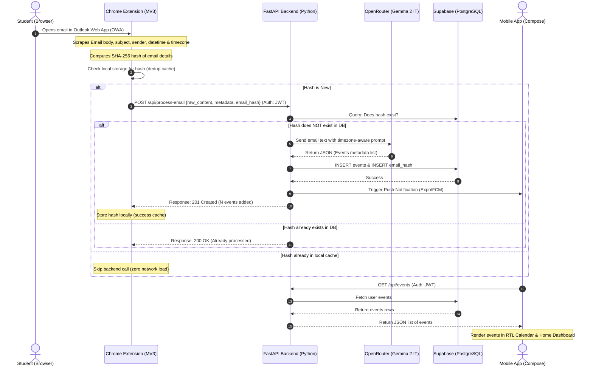

# 🤖 Miyad (ميعاد) - Comprehensive Project Plan & Blueprint
> **Version:** 3.0.0 | **Language:** English  
> **Backend Stack:** FastAPI (Python) + Supabase (PostgreSQL)  
> **LLM Service:** OpenRouter (Gemma 2 9B Instruct Free)  
> **Client Interfaces:** Chrome Extension (MV3) + Jetpack Compose Android App  

---

## 📌 1. Product Vision & Core Architecture

### Core Problem
University students receive critical academic deadlines, exam dates, quiz schedules, and assignment details through university-issued Outlook emails. However, academic institutions typically block third-party API access, disable automatic forwarding to personal accounts, and restrict external calendar syncs for security and compliance.

### Core Solution
Miyad (ميعاد) bypasses these server-side restrictions client-side:
1. **Chrome Extension (MV3)**: Runs silently in the student's browser. When the student opens an email in Outlook Web App (OWA), the extension scrapes the text client-side, computes a unique SHA-256 fingerprint (hash) of the email contents to prevent duplicate extraction, and securely sends it to the FastAPI backend.
2. **FastAPI Backend (Python)**: Validates the request using a persistent JWT token, checks the database to ensure this email hasn't been parsed before, forwards the text to **OpenRouter** (calling the free **Gemma 2 9B IT** model), receives structured JSON event details, and writes them to the database.
3. **Supabase Database (PostgreSQL)**: Acts as the central multi-tenant data store. Each user's data is isolated.
4. **Mobile App (Kotlin + Jetpack Compose)**: Integrates with the database, renders a premium RTL calendar, displays deadlines grouped by urgency, and manages local alarms or push notifications.

---

## 🏗️ 2. System Data Flow



---

## 💾 3. Database Schema (Supabase / PostgreSQL)

The database handles multi-tenant isolation using foreign keys linked to the `users` table.

```sql
-- Enable UUID generation extension
CREATE EXTENSION IF NOT EXISTS "uuid-ossp";

-- 1. Users Table
CREATE TABLE users (
    id UUID PRIMARY KEY DEFAULT gen_random_uuid(),
    email TEXT UNIQUE NOT NULL,
    password_hash TEXT NOT NULL,
    name TEXT,
    university TEXT,
    created_at TIMESTAMPTZ DEFAULT NOW()
);

-- Index for authentication lookup
CREATE INDEX idx_users_email ON users(email);

-- 2. Email Hashes (For client/server deduplication)
CREATE TABLE email_hashes (
    hash TEXT PRIMARY KEY, -- SHA-256 hash of: subject + sender + timestamp + body.slice(0, 100)
    user_id UUID REFERENCES users(id) ON DELETE CASCADE,
    subject TEXT,
    processed_at TIMESTAMPTZ DEFAULT NOW()
);

-- Index to query user's history
CREATE INDEX idx_email_hashes_user ON email_hashes(user_id);

-- 3. Events Table
CREATE TABLE events (
    id UUID PRIMARY KEY DEFAULT gen_random_uuid(),
    user_id UUID REFERENCES users(id) ON DELETE CASCADE,
    title TEXT NOT NULL,
    course_code TEXT,
    event_type TEXT CHECK (event_type IN ('exam', 'deadline', 'quiz', 'lecture', 'other')),
    due_date TIMESTAMPTZ NOT NULL,
    location TEXT,
    notes TEXT,
    source_hash TEXT REFERENCES email_hashes(hash) ON DELETE SET NULL,
    created_at TIMESTAMPTZ DEFAULT NOW()
);

-- Index to fetch user events efficiently (calendar ranges)
CREATE INDEX idx_events_user_date ON events(user_id, due_date);
```

---

## 🐍 4. FastAPI Backend Component Specification

The backend project will structure code cleanly, separating database interactions, API endpoints, schemas, and AI services.

### 4.1 Folder Structure
```
backend/
├── app/
│   ├── __init__.py
│   ├── main.py                 # Application entrypoint & middleware configuration
│   ├── core/
│   │   ├── __init__.py
│   │   ├── config.py           # Environment variables configurations using Pydantic Settings
│   │   ├── database.py         # Supabase Client connection instance
│   │   └── security.py         # JWT Token creation/validation & password hashing (bcrypt)
│   ├── api/
│   │   ├── __init__.py
│   │   ├── auth.py             # Router: Sign Up & Sign In endpoints
│   │   ├── email.py            # Router: Process scraped emails
│   │   └── event.py            # Router: Fetch and delete events
│   ├── schemas/
│   │   ├── __init__.py
│   │   ├── auth.py             # Pydantic schemas for User Sign In/Up
│   │   ├── email.py            # Pydantic schemas for incoming email payload
│   │   └── event.py            # Pydantic schemas for event details returned to frontend
│   └── services/
│       ├── __init__.py
│       ├── llm.py              # OpenRouter API Gemma integration and prompt builder
│       └── notification.py     # Push Notifications Dispatcher (Expo / Firebase Cloud Messaging)
├── requirements.txt            # Package dependencies
├── Dockerfile                  # Container settings for deployment
└── .env                        # Configuration secrets
```

### 4.2 API Endpoint Registry

#### Authentication Router (`/api/auth`)
*   **`POST /api/auth/register`**:
    *   **Body**: `{ "email": "...", "password": "...", "name": "...", "university": "..." }`
    *   **Logic**: Hashes password with Bcrypt, checks user existence, inserts user row in Supabase, issues JWT.
    *   **Response**: `201 Created` -> `{ "user": { "id": "...", "email": "..." }, "token": "JWT_TOKEN_HERE" }`
*   **`POST /api/auth/login`**:
    *   **Body**: `{ "email": "...", "password": "..." }`
    *   **Logic**: Validates credentials, creates JWT.
    *   **Response**: `200 OK` -> `{ "user": { "id": "...", "email": "..." }, "token": "JWT_TOKEN_HERE" }`

#### Email Processing Router (`/api/process-email`)
*   **`POST /api/process-email`**:
    *   **Headers**: `Authorization: Bearer <JWT_TOKEN>`
    *   **Body**:
        ```json
        {
          "metadata": {
            "sender": "dr.ahmed@university.edu.sa",
            "subject": "Midterm Exam Announcement",
            "timestamp": "2026-06-11T10:00:00Z",
            "timezone": "Asia/Riyadh"
          },
          "raw_content": "The Advanced Mathematics midterm will take place on Tuesday next week at 1 PM in Hall 4-B.",
          "email_hash": "sha256:8f2a9c3d4e..."
        }
        ```
    *   **Logic**:
        1. Parse JWT to verify `user_id`.
        2. Query `email_hashes` by `email_hash` and `user_id`.
        3. If present: Return `200 OK` with `{ "status": "already_processed", "events_created": 0 }`.
        4. If absent: Send text and metadata to LLM service.
        5. Insert resulting events into database.
        6. Store email hash into `email_hashes`.
        7. Send push notifications to mobile device.
    *   **Response**: `201 Created` -> `{ "status": "success", "events_created": 1 }`

#### Events Router (`/api/events`)
*   **`GET /api/events`**:
    *   **Headers**: `Authorization: Bearer <JWT_TOKEN>`
    *   **Query Params**: `?from_date=ISO_DATE&to_date=ISO_DATE` (optional date ranges)
    *   **Response**: `200 OK` -> `{ "events": [ { "id": "...", "title": "Math Midterm", "due_date": "2026-06-16T13:00:00+03:00", ... } ] }`
*   **`DELETE /api/events/{id}`**:
    *   **Headers**: `Authorization: Bearer <JWT_TOKEN>`
    *   **Logic**: Deletes the event, validating that the event belongs to the requesting user.
    *   **Response**: `200 OK` -> `{ "success": true }`

---

## 🤖 5. OpenRouter & LLM Extraction Service

The backend utilizes OpenRouter's API endpoint to send the scraped content to the free **Gemma 2 9B Instruct** model.

*   **API Endpoint**: `https://openrouter.ai/api/v1/chat/completions`
*   **Model Identifier**: `google/gemma-2-9b-it:free`
*   **Request Headers**:
    *   `Authorization: Bearer <OPENROUTER_API_KEY>`
    *   `HTTP-Referer`: `https://miyad.app` (Required by OpenRouter)
    *   `X-Title`: `Miyad Academic Assistant`

### 5.1 System Prompt
```
You are an academic schedule extraction assistant.
Your ONLY job is to read university email content and extract academic events.
You MUST return ONLY valid JSON. No explanation. No markdown. No preamble.
If no academic events are found, return: {"events": []}
All datetime values in your output MUST be converted to strict ISO 8601 format
using the student's local timezone provided in the prompt. Never assume UTC.
```

### 5.2 User Prompt Template
```
Extract all academic deadlines, exams, quizzes, assignments, and events 
from the following university email.

Email Subject: {subject}
Email Sender: {sender}
Email Date: {timestamp}
Student Local Timezone: {timezone}   ← IMPORTANT: Use this timezone when
                                          converting ALL times to ISO 8601.
                                          e.g. "Tuesday at 2 PM" must be
                                          resolved using this timezone.

Email Body:
---
{raw_content}
---

Return a JSON object with this exact structure:
{
  "events": [
    {
      "title": "string (descriptive event name in Arabic if the email is in Arabic, or English if the email is in English)",
      "course_code": "string or null (e.g. CS101)",
      "event_type": "exam | deadline | quiz | lecture | other",
      "due_date": "ISO 8601 datetime string (timezone-aware, e.g. 2026-06-16T13:00:00+03:00)",
      "location": "string or null (room, building, or 'Online')",
      "notes": "string or null (any extra relevant details like guidelines or materials)"
    }
  ]
}
```

### 5.3 AI Response Pydantic Validator
```python
from pydantic import BaseModel, Field
from typing import List, Optional
from datetime import datetime

class EventItem(BaseModel):
    title: str = Field(..., min_length=1)
    course_code: Optional[str] = None
    event_type: str = Field(..., pattern="^(exam|deadline|quiz|lecture|other)$")
    due_date: datetime
    location: Optional[str] = None
    notes: Optional[str] = None

class LLMExtractionResponse(BaseModel):
    events: List[EventItem]
```

---

## 🌐 6. Chrome Extension Component Specification

The browser extension is built using standard Manifest V3 for Google Chrome. It runs seamlessly on university Outlook Web App accounts.

### 6.1 manifest.json
```json
{
  "manifest_version": 3,
  "name": "Miyad - Academic Deadlines Extractor",
  "version": "1.0.0",
  "description": "Automatically capture academic deadlines from Outlook emails to your Miyad calendar.",
  "permissions": [
    "storage",
    "contextMenus"
  ],
  "host_permissions": [
    "https://outlook.office.com/*",
    "https://outlook.live.com/*"
  ],
  "background": {
    "service_worker": "src/background.js"
  },
  "content_scripts": [
    {
      "matches": [
        "https://outlook.office.com/*",
        "https://outlook.live.com/*"
      ],
      "js": ["src/content.js"],
      "run_at": "document_idle"
    }
  ],
  "action": {
    "default_popup": "src/popup/popup.html",
    "default_icon": {
      "16": "icons/icon-16.png",
      "48": "icons/icon-48.png",
      "128": "icons/icon-128.png"
    }
  },
  "icons": {
    "16": "icons/icon-16.png",
    "48": "icons/icon-48.png",
    "128": "icons/icon-128.png"
  }
}
```

### 6.2 content.js (Outlook Scraper)
*   **Trigger Mechanism**: URL Polling (checks for URL path changes in Outlook, e.g. `owa/#path/mail/id/...` every 500ms).
*   **Observer Mechanism**: Once a new email ID is opened in the URL, a `MutationObserver` is attached **exclusively** to the Reading Pane.
*   **Scraping Selectors**:
    *   *Classic OWA Reading Pane*: `.ReadingPaneContents`
    *   *New OWA Reading Pane*: `[aria-label="Message body"]`
*   **Target Elements**:
    *   *Subject*: `h1[aria-level="2"]` or `.SubjectHeader`
    *   *Sender*: `span[title*="@"]` or `[aria-label*="From"]`
    *   *Timestamp*: `time[datetime]` (extracting the ISO 8601 attribute value)
    *   *Body*: Extracted via `innerText` of the reading pane container.
*   **User Timezone**: Obtained automatically using `Intl.DateTimeFormat().resolvedOptions().timeZone` (e.g. `Asia/Riyadh`).
*   **Communication**: Sends details to the background script via `chrome.runtime.sendMessage`.

### 6.3 background.js (Network Handler)
*   **Security Processing**:
    1. Receives data from `content.js`.
    2. Calculates a SHA-256 hash using the Web Crypto API:
       `hash = SHA256(Subject + Sender + ISO_Timestamp + Body.slice(0, 100))`
    3. Queries `chrome.storage.local` to verify if this hash is already cached.
    4. If cache hits: Terminate processing immediately.
    5. If cache misses: Retrieve user JWT token from `chrome.storage.sync`.
    6. Send `POST /api/process-email` to the FastAPI backend.
    7. On success (`201`): Store hash in local storage to prevent future redundant calls.
*   **Context Menus (Manual Override)**:
    *   Registers a context menu item: *"Send to Miyad (إرسال إلى ميعاد)"*.
    *   Allows students to highlight any custom text inside Outlook, right-click, and force manual extraction.

### 6.4 Popup UI Design (`popup.html`/`popup.js`/`popup.css`)
Designed with **Thmanyah brand aesthetics**:
*   **Color Palette**: Dark theme background (`#101610`), Lime Green highlights (`#B8F23A`), and off-white text (`#F8F9F6`).
*   **Typography**: Styled using Google Fonts *Outfit* or *Inter* as a fallback to mimic the Thmanyah Sans layout.
*   **Features**:
    *   Login & Register forms (syncing user token with backend).
    *   Live Sync Status indicator (displays "Connected & Monitoring Outlook").
    *   Recent activities list (last 3 extracted events with checkmark symbols).
    *   Logout action.

---

## 📱 7. Mobile App Synchronization (Kotlin/Jetpack Compose)

The mobile app represents the primary viewing platform for the student.

1.  **Retrofit Client Integration**:
    *   Base URL configured to the deployed FastAPI address.
    *   Endpoints mapped:
        *   `POST /api/auth/register`
        *   `POST /api/auth/login`
        *   `GET /api/events` (Passes JWT token in `Authorization` header)
        *   `DELETE /api/events/{id}`
2.  **RTL Calendar Display**:
    *   Days highlighting deadlines are rendered using the brand Lime Green color `#B8F23A`.
    *   Event cards are displayed in Arabic with custom weights utilizing the premium `ThmanyahSerifDisplay` (for headers) and `ThmanyahSerifText` (for event summaries and notes).
3.  **Manual Paste Interface**:
    *   Under the **Smart Extraction (الاستخلاص الذكي)** screen, a text input field is provided.
    *   Allows students to manually copy email text on their mobile device and click *"Extract"* to run the exact same FastAPI parsing pipeline.
4.  **Reminder Schedule**:
    *   Retrieves events from the database.
    *   Uses Android `AlarmManager` to register local notifications:
        *   Standard tasks: 1 day before.
        *   Major Exams & Presentations: 1 week before + 1 day before.

---

## 🔒 8. Security & Reliability Models

*   **Zero Credentials Stored**: Miyad does not request or save the student's university login password. All email scraping happens under the student's active browser session.
*   **API Key Protection**: The OpenRouter API credentials reside strictly in the backend `.env` file. The Chrome Extension never touches the AI keys directly.
*   **Data Minimization**: The FastAPI backend processes the raw email body, generates the structured database JSON, and immediately discards the raw email text. Only the structured events are preserved in the DB.
*   **Session Longevity**: JWT tokens do not set expiration parameters. Sessions remain persistent on both the browser and the mobile app until the user triggers a manual sign out.
*   **Duplicate Event Prevention**: Hashing logic executes at two layers:
    1. *Extension Layer (Local)*: Skips duplicate API calls entirely, preserving browser performance.
    2. *Database Layer (Remote)*: Unique index constraint on `email_hashes` rejects duplicate payloads at the database entry level.

---

## 🏁 9. Implementation Phases

```
┌────────────────────────────────────────────────────────┐
│  Phase 1: Backend Setup & Database Schema Deployment   │
└───────────────────────────┬────────────────────────────┘
                            ▼
┌────────────────────────────────────────────────────────┐
│  Phase 2: OpenRouter Integration & Extraction Testing   │
└───────────────────────────┬────────────────────────────┘
                            ▼
┌────────────────────────────────────────────────────────┐
│  Phase 3: Chrome Extension Development (MV3 Scraper)   │
└───────────────────────────┬────────────────────────────┘
                            ▼
┌────────────────────────────────────────────────────────┐
│  Phase 4: Mobile App Network Sync & Calendar Update    │
└───────────────────────────┬────────────────────────────┘
                            ▼
┌────────────────────────────────────────────────────────┐
│  Phase 5: Live System Verification & Performance Audit │
└────────────────────────────────────────────────────────┘
```

### Phase 1: Database & Backend Initialization
- Deploy database schemas on Supabase.
- Initialize FastAPI project skeleton and create schemas.
- Implement registration and login routes with password hashing and JWT token generator.

### Phase 2: OpenRouter Integration
- Implement LLM service with custom system and user prompt structures.
- Setup standard error handling and rate-limiting middleware (20 requests/hour/user).
- Write verification scripts to test output validation with Pydantic.

### Phase 3: Chrome Extension Development
- Build `manifest.json` and configure domain permissions.
- Implement `content.js` and test reading pane mutation observers on OWA.
- Implement background token storage, SHA-256 hashing, and API payload transfer.
- Create Thmanyah-themed Popup page.

### Phase 4: Mobile App Synchronization
- Modify Retrofit endpoints in `DataRepository.kt` matching FastAPI endpoints.
- Hook up calendar view to consume live events from backend.
- Connect Smart Extraction Screen to permit manual mobile text submission.

### Phase 5: Verification & End-to-End Audit
- Verify duplicate prevention handles multi-device sync.
- Test edge-case emails containing multiple exams/deadlines.
- Validate timezone parsing (ensure a deadline scheduled at 2:00 PM Riyadh time correctly offsets on student calendar).
